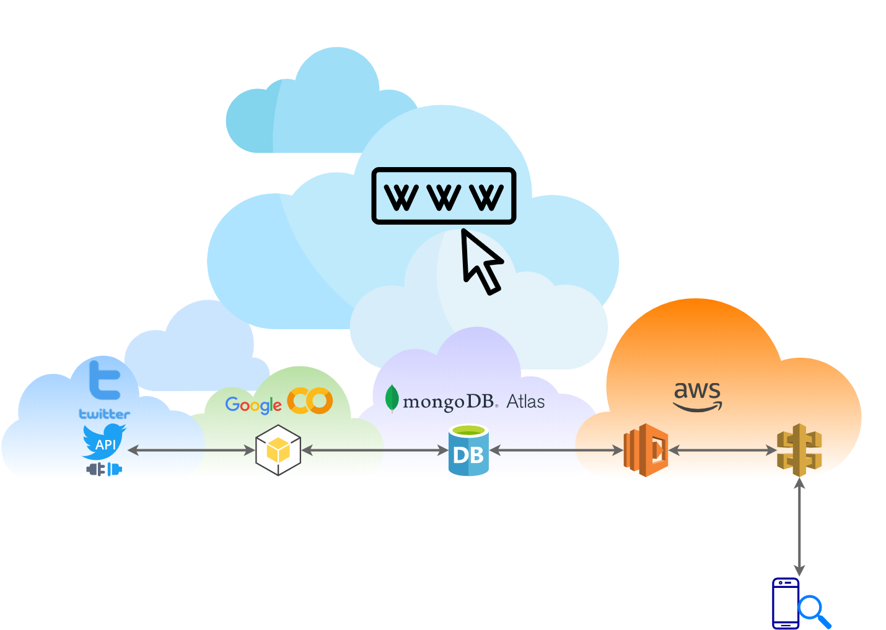
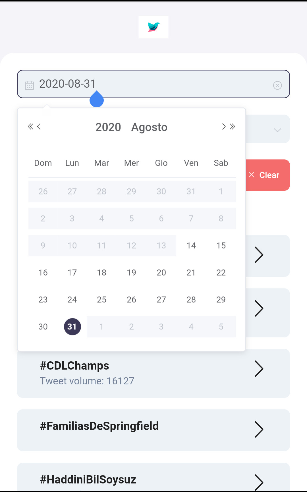
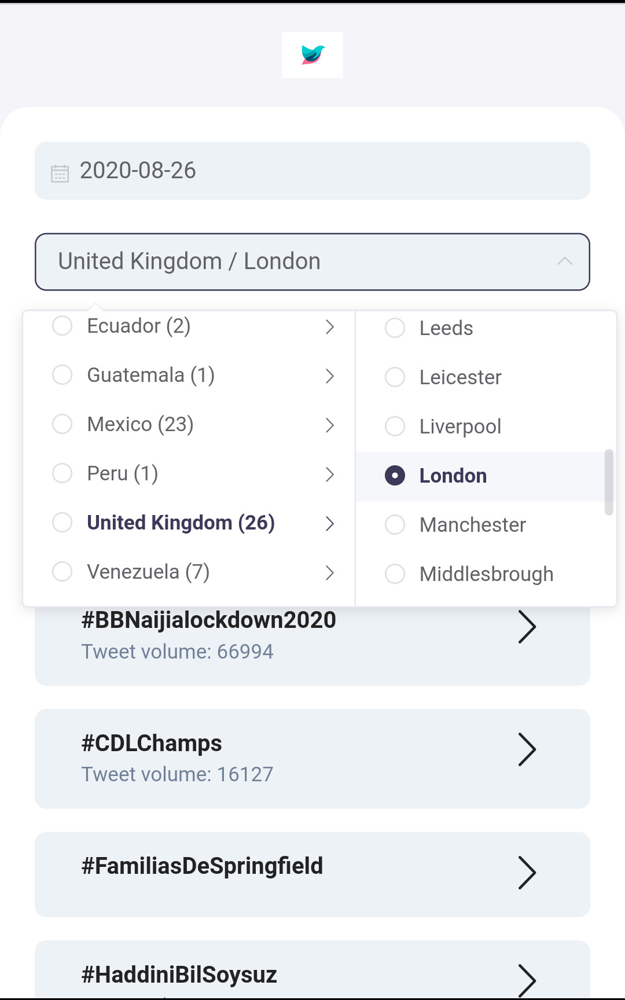
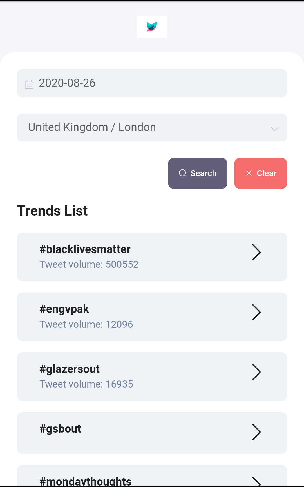
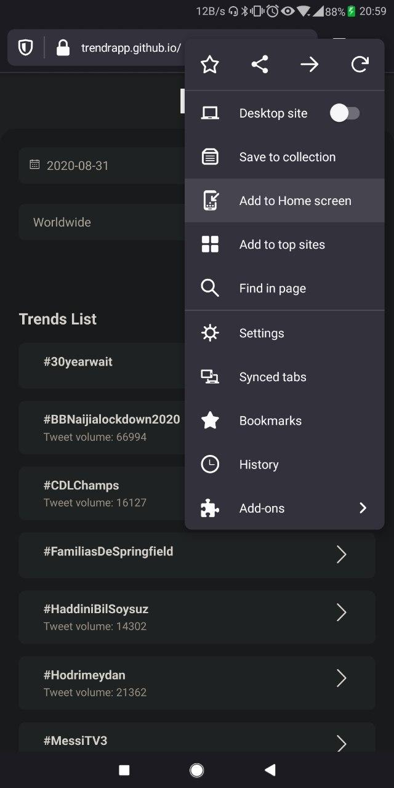
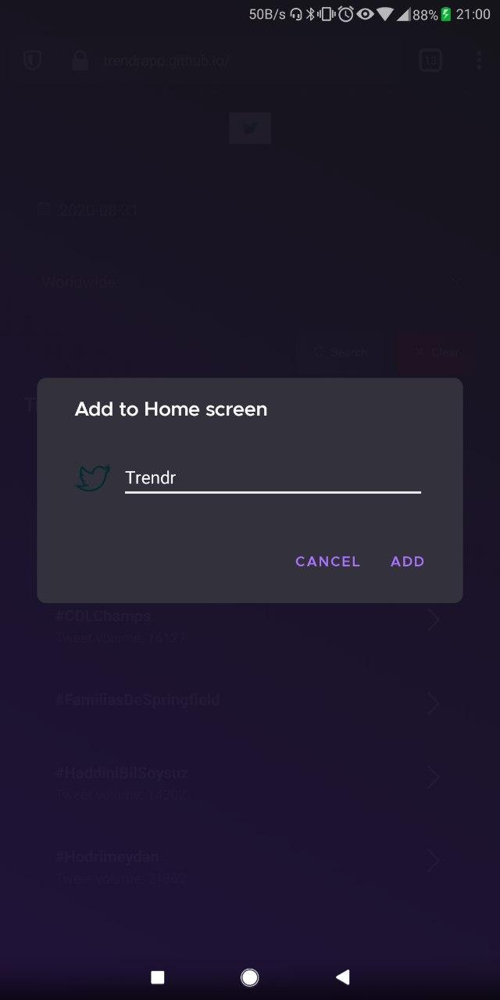
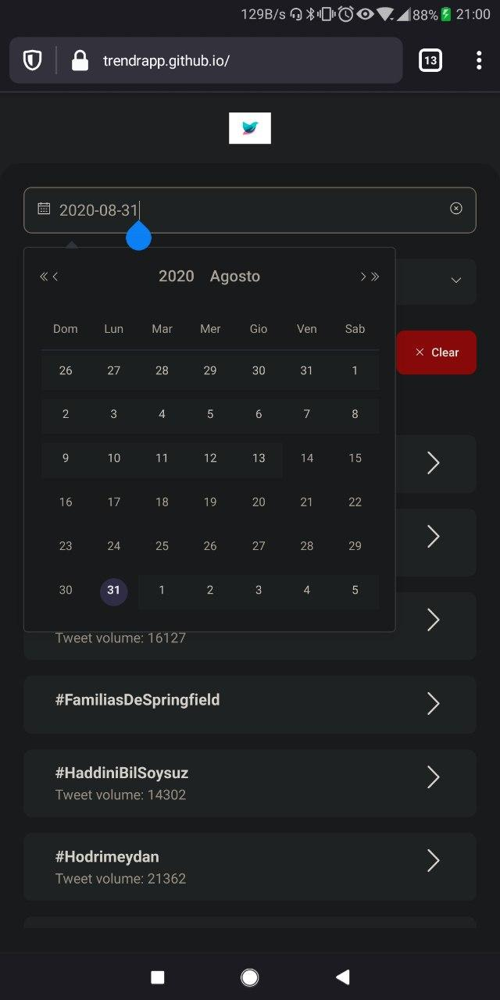
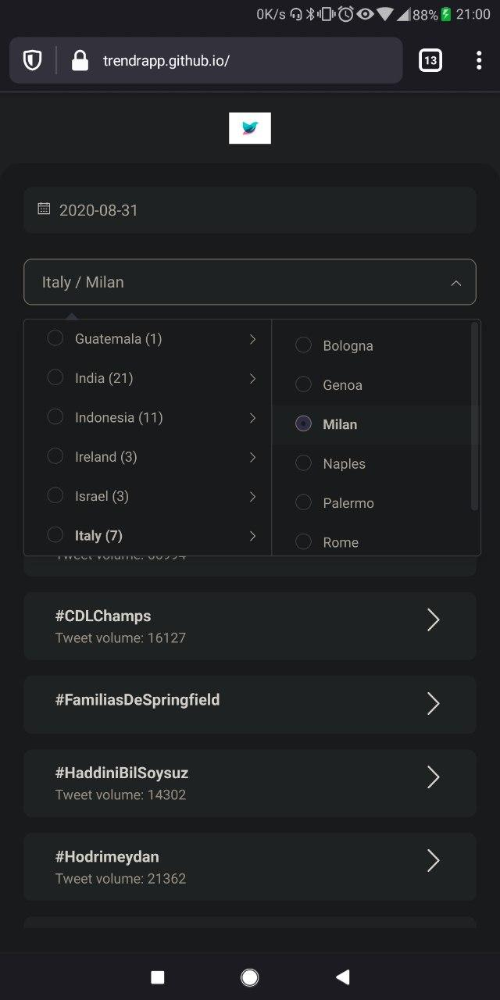
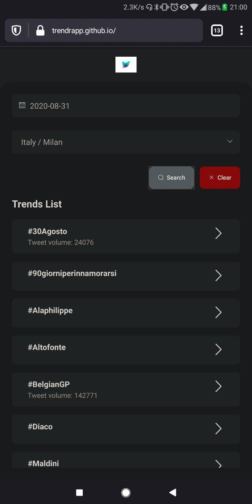

# Trendr_App

Twitter Trends history explorer app. Trending topics can be explored by date and location. Backend is served with Lambda Function (NodeJS) from AWS. Frontend is made with VueJS. Twitter API gets queried by a Python script from Google Colab. MongoDB database used to save trend's data.

Short documentation (slides) in Italian language is available here: [Trendr_App.pdf](./docs/pdf_slides/Trendr_App_Anonimo.pdf)

## Macrolevel Architecture

## Visual state of the project

